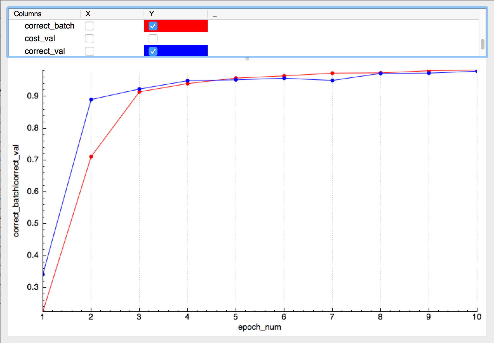

## About

This is a self-implemented version of Deep Convolutional Neural Network (DCNN). The net includes `fully-connected` layers, and `convolutional` layers (include `max-pooling`). The algorithm demonstrates satisfying learning outcome for classification of several real life datasets (e.g., **[digits](#digit_usps), [blood cells](#blood_cells), [algae cells ](#algae_cells)**).

**Net Structure:**

- Specify details of each layer as `*.yaml` file
- `FC` layers:
  - support user-defined net activation function & cost function
- `convolutional` layers:
  - support any `stride` & `padding`
  - `feed-forward` & `back-propogation` are expressed in a single high-level function `slid_win_4d_flip`

## Software Requirements
- Language: `Python3`
- `Python` packages: 
  - `numpy`, `yaml` (required for DCNN)
  - `sqlite3` (required for profiling the training process)
  - `subprocess` (optional, for connection with `Amazon ec2` server)
- Easy installation: [Anaconda](https://www.continuum.io/downloads) containing most of the required packages.
- [Optional] To conveniently view the profiling data in the `sqlite3` database, you may install a db viewer (for example: [this one](http://sqlitebrowser.org))

## Directory Structure

- `main.py`: takes one `yaml` model to train 
- `./net/`: high level definition of the algorithm
	- `./net/structure.py`: CNN structure and main training loop
	- `./net/cost.py`: cost function definition
	- `./net/node_activity.py`: layer activation definition
	- `./net/data_setup.py`: load training data
	- `./net/conf.py`: high-level configuration macros
- `./conv/`: convolution & pooling layer definition
	- `./conv/slide_win.py`: extract out the common operation for both conv and pooling layers
	- `./conv/conv_layer.py`: convolution layer definition
	- `./conv/pool_layer.py`: max pooling layer definition
	- `./conv/util.py`: other utility functions
- `./db_util/`: utility function for populating the profiling data throughout the training into `sqlite3` database
- `./logf/`: unifying the logging behavior
- `./util/`: general utility functions (e.g., pre-processing data to convert it from `*.mat` into `*.npz` or `*.h5`)
- `./ec2/`: interface to `Amazon ec2` servers, for running training on remote machine
- `./stat_cnn/`: global variables storing statistics throughout training
- `./yaml_model/`: user defined CNN models
- `./checkpoint/`: store the CNN checkpoints throughout training
- `./profile_data/`: store the profiling data throughout training
- `./train_data/`: directory for storing the training datasets (symbol link: **[N.B.]** re-link this to your own local data directory)

## Totorial

### Warm Up: Digit Classification 

- Data set: USPS
- Data Format: `npz`
- Image: 16 x 16 grey scale (1 input channel)
- Obtain data from [here](https://drive.google.com/open?id=0B3_QnE0SWYqPQktPNVFKajJLblk), put the 3 `*.npz` files under `./train_data/digit_usps/`
- Run `python3 main.py ./yaml_model/digit_usps.yaml` for training
- Inspect profiling data from `./profile_data/digit_usps/` and checkpoint from `./checkpoint/`
	- Sample plot from the profiling data (`epoch` vs. `classification accuracy`):
	- 

### CNN with Multiple Input Channels: Blood Cell Classification 

- Data set: self-generated cell images (MCF7, PBMC, THP1 and Debris)
- Data Format: `npz`
- Image: 305 x 305 "norm" image (4 input channels)
- Obtain data from [here](https://drive.google.com/open?id=0B3_QnE0SWYqPUGVkempZa0FCSVk), put the 3 `*.npz` files under `./train_data/cell_MCF7.PBMC.THP1.Debris_norm/`
- Run `python3 main.py ./yaml_model/cell_MCF7.PBMC.THP1.Debris_norm.yaml` for training
- Inspect profiling data from `./profile_data/cell_MCF7.PBMC.THP1.Debris_norm/` and checkpoint from `./checkpoint/`

### CNN with Huge Data Sets: Algae Cell Classification 

- Data set: self-generated algae images (9 categories)
- Data Format: `hdf5` (Unlike `npz`, `hdf5` files don't need to fit into memory)
- Image: 511 x 511 "phase" image (1 input channel)
- Obtain data from [here](https://drive.google.com/open?id=0B3_QnE0SWYqPYU1ra3JHQ1Jfbjg), put the 3 `*.h5` files under `./train_data/cell_algae_phase/`
- Run `python3 main.py ./yaml_model/cell_algae_phase.yaml` for training
- Inspect profiling data from `./profile_data/cell_algae_phase/` and checkpoint from `./checkpoint/`

### Others
- Run `python3 main.py <yaml model> -p <previous npz checkpoint file>` to resume the training from the checkpoint.
- The profiling database file
	- `ann.db` contains 2 tables: `meta` and `profile_cost`, identified by the populating timestamp. Each table may contain information for different runs. You could easily compare several CNN models for the same data set within a single `ann.db`.
	- `eval_out_prob.db` is for evaulating the testing data set. It stores the classification probablility output by the final CNN (and sort these probabilities in ascending order). It also seperates the correctly classified data from the wrong ones. 
- ...